# Python 学习笔记
本笔记使用的Python版本为3.11

`更新时间:2024-10-12`

- `<>`必填项，必须在当前位置填写相应数据
- `{}`必选项，必须在当前位置选择一个给出的选项
- `[]`可选项，可以选择填写或忽略

*print("Hello World!")*

## Python 基础语法

### 数据类型

Python 中有6个数据类型，分别是:
- 数字(Number)
> 数字类型又可分为4种类型，即 整数(int), 浮点数(float), 
复数(complex), 布尔值(bool) <br>
> 
> - 整数(int), 例如 `10`, `-10`, `123`<br>
> - 浮点数(float), 例如 `13.4`, `-13.4`<br>
> - 复数(complex), 例如 `4+3j`, 以`j`结尾表示复数<br>
> - 布尔值(bool), 真(true), 假(false), 本质上是一个数字,
> `1`表示`true`, `0`表示`false`
- 字符串(String)
> 由任意数的字符组成, 必须用双引号`"`围起来, 例如 `"abc123"`, `"Python学习笔记"`
- 列表(List)
> 有序的可变序列, Python中使用最频繁数据类型
- 元组(Tuple)
> 有序的不可变序列, 可有序记录一堆不可变地Python数据集合
- 集合(Set)
> 无序不重复集合, 可无序记录一堆不重复地Python数据集合
- 字典(Dictionary)
> 无序Key-Value集合, 可无序记录一堆Key-Value型的Python数据集合

### 注释

*在所有编程语言中, 注释都是非常重要的工具*

在Python中, 注释与大多数编程语言一样, 分为两类<br>
- 行注释: 以井号`#`开头, 井号的右边所有文字作为注释
    ```python
    # 这是一条注释
    # 这是一条注释
    # 这是一条注释
    ```
- 段落注释: 用 一对三个双引号`"""` 括起来的内容作为段落注释
    ```python
    """
        这是一条注释
        这是一条注释
        这是一条注释 
    """
    ```
### 变量

Python是动态类型语言, 所以定义变量时无需声明变量类型

定义变量的格式: `<变量名>` = `<变量值>`
```python
# 定义一些变量
a = 1
b = 2.0
c = "Python"
# 输出这些变量
print(a, b, c)
```


Python从3.6开始也支持静态类型

静态类型变量的定义格式: `<变量名>` : `<变量类型>` = `<变量值>`
```python
# 定义一些静态变量
a : int = 1
b : float = 2.0
c : str = "Python"
# 输出这些变量
print(a, b, c)
```


Python本质上还是动态类型语言, 所以运行时还是以动态类型方式, 即使变量值与声明的类型不一致仍然能够运行
```python
# 定义一些与声明类型不一致的静态变量
a : str = 1
b : int = 2.0
c : bool = "Python"
# 输出这些变量
print(a, b, c)
```


**数据类型与转换**

上面我们已经学习了Python中常见的数据类型, 这里我们主要了解获取数据类型的方式与数据类型转换

Python提供一个专门的函数 `type()`用于获取变量或字面量的数据类型
```python
# 定义几个变量
a = 1       # 变量 a 是 int 类型
2.0     # 字面量 2.0 是 float 类型
c = "Python" # 变量 C 是 string 类型
# 获取并输出这几个变量的数据类型
print(type(a))
print(type(2.0))
print(type(c))
```


需要注意的是, 字符串类型(string) 的类型标识符为`str`, 而不是`string`

使用`type()`函数获取静态类型变量的数据类型时, 结果是怎样的?
```python
# 定义静态类型变量
a : int = 1
# 输出变量的数据类型
print(type(a))
# 给静态类型变量赋予一个不同类型的数据
a = 2.0
# 输出变量的数据类型
print(type(a))
```


也就是说, 即使使用静态类型变量, 其数据类型仍然跟随所储存的字面量的数据类型

`type()`函数拥有一个`str`类型的返回值, 返回值为所求取字面量或变量的数据类型

Python提供了许多用于数据类型转换的函数, 例如`int()`, `float()`, `str()`, 返回值为函数名
```python
# 类型转换函数的基本用法
<函数名>(<变量名或表达式>)
```
```python
# 定义不用的变量储存不同类型的数据
a = 1       # a 为 int 类型
b = 2.0     # b 为 float 类型
c = "333"   # c 为 str 类型
# 将它们的类型转换
a = str(a)
b = int(b)
c = float(c)
# 输出它们的数值和类型
print(a, type(a))
print(b, type(b))
print(c, type(c))
```


注意
- `int()`, `float()`等返回值为数值型的类型转换函数, 其参数只能是数值型或数字字符串
- `int()` 函数的参数为实型数据时, 返回值将直接舍弃小数部分, 只保留整数部分, 不进行四舍五入
- 任意字符都可以作为`str()`函数的参数

### 标识符

标识符就是编程时使用的名字,用于给变量、常量、函数等命名.
在Python中,标识符命名的规则有以下几点:
- 只允许使用英文、中文、数字、下划线
- 不能与系统标识符(关键字)关键字同名
- 对大小写敏感
- 不能以数字开头

以下是一些标识符的例子
```python
# 以下是一些合法的标识符
a_b
A_b     # 与a_b是两个不同的标识符
_ab
_a0123b
张三_a  # 合法,但不推荐

# 以下是一些不合法的标识符
import  # 与import命令重名
0_a11   # 以数字开头
```
尽管Python支持中文标识符,但中文标识符在使用过程中可能会出现未知的问题,所以不建议使用

*标识符名很简单*<br>
*字母数字下划线*<br>
*非数打头非关键*<br>
*字母区分大小写*<br>

**变量的命名规范**

标识符不仅有严格的命名规则,使用过程中还需要遵守其命名规范

Python中标识符的命名规范分为三种:
- 变量名
- 类名
- 方法名

不同的标识符有不同的命名规范,目前我们只学习了变量,所以只学习变量的命名规范

变量的命名规范有以下几点:

- 见名之意

要尽量做到,看到变量名字,就知道变量的作用
```python
# 以下的变量没有做到见名之意,无法一眼就了解其作用
a = "张三"
b = 21
c = 175

# 以下的变量能够做到见名之意,一目了然,简洁高效
name = "张三"
age = 21
height = 175
```

- 下划线命名法

多个单词组合命名时,要使用下划线分隔
```python
# 以下的变量没有使用下划线命名法,难以阅读
playernickname = "张三"
playerage = 21

# 以下的变量使用了下划线命名法,便于阅读
player_nickname = "张三"
player_age = 21
```

- 英文字母全小写

变量名中的英文字母应全部小写
```python
# 以下的变量的标识符大小写混用,使用时极易导致混乱
Name = "张三"
name = "小二"

# 以下的变量的标识符保持全部小写,无需担心使用时混淆大小写
name_1 = "张三"
name_2 = "小二"
```

*在大部分编程语言中,标识符的命名规则与规范都相差不大*

### 运算符

- 数学(算术)运算符

Python中的部分数学运算符与其他编程语言没有区别,加减乘除均为`+`,`-`,`*`,`/`,其余的有:<br>
取整除(不四舍五入)`//`, 取余`%`, 指数`**`
```python
a = 9
b = 2

# 取整除运算符 //, 向下取整, 不四舍五入
print("a // b =", a // b)

# 取余运算符 %, 又称取模运算符, 直接求取余数
print("a % b =", a % b)

# 指数运算符 **, 符号前为底数, 后为指数
print("a ** b =", a ** b)
```


- 赋值运算符

一个等号`=`就是一个赋值运算符,它的作用是将等号右边的表达式的值赋值给等号左边的变量

Python还提供了特别的复合赋值运算符, 它们的形式均为数学运算符后紧跟一个等号
```python
# 复合赋值运算符的形式
a += b  # 等同于 a = a + b
a -= b  # 等同于 a = a - b
a *= b  # 等同于 a = a * b
a /= b  # 等同于 a = a / b
a %= b  # 等同于 a = a % b
a **= b # 等同于 a = a ** b
a //= b # 等同于 a = a // b
```
*注意,复合赋值运算会直接改变变量的值,而数学运算不会改变变量的值*

### 字符串

- 字符串的定义方式

在上面我们已经学习了字符串的定义方法,为什么这里还要学习呢?<br>
在Python中,字符串其实有三种定义方法:
```python
# 单引号定义法 '
name = '张三'

# 双引号定义法 "
name = "张三"

# 三引号定义法 """
name = """张三"""
```

三引号定义法与段落注释写法一样,支持多行操作,使用变量接收,它就是字符串,不使用变量接收,它就是注释
```python
# 这是一个多行的字符串
message = """
    第一行文字
    第二行文字
    第三行文字
"""

# 这是一个段落注释
"""
    第一行文字
    第二行文字
    第三行文字
"""
```

- 转义符

我们刚刚学习了三种字符串的定义方式,它们都有一个共同点,都需要使用引号作为定界符,如果需要在字符串中使用定界符,那该怎么办呢?

我们可以使用与定界符不一样的引号,比如,使用单引号定义时,字符串中可以使用双引号,反之同理
```python
# 在字符串中使用引号
str_1 = "I'm Worker"
str_2 = 'I like "Minecraft"'

print(str_1 + '\n' + str_2)
```


另外,我们还可以使用一种名为转义符的特殊符号表示引号,它的用法很简单,并且不受定义方式的限制

转义符就是一个反斜线`\`, 其后紧跟需要转义的符号,比如单双引号`\'`,`\"`
```python
# 使用转义符号表示引号
str_1 = "I\'m Worker, I like \"Minecraft\""

print(str_1)
```


- 字符串拼接

如果我们有两个字符串,想要把它们链接成一个字符串,该怎么操作呢?这个时候,我们就需要用到python中的字符串拼接

在上面的案例中我们其实已经见过了,使用一个加号`+`即可拼接字符串
```python
# 拼接两个字符串
str_1 = "Hello"
str_2 = "World!"

print(str_1 + ", " + str_2)
```


*不是字符串的数据可以拼接吗?*

- 字符串格式化

如果只使用字符串拼接,那将会遇到很多问题,比如,无法将数字与字符串直接进行拼接,或是需要拼接的字符串太多,使用起来很麻烦,所以,python提供了字符串格式化来解决这些问题

字符串格式化需要使用一个占位符`%`,其后紧跟一个英文字母,不同的英文字母代表不同的数据类型<br>
在定义字符串时,将占位符写在字符串内需要替换的位置,并在字符串后加上一个百分号`%`,百分号右侧写上需要替换的内容变量列表,多个变量需要使用括号括起来,用逗号分隔
```python
# 一些基本的占位符
%s # 将内容转换为字符串, 放入占位位置
%d # 将内容转换为整数, 放入占位位置
%f # 将内容转换为浮点型, 放入占位位置
```
*似乎跟C语言有点类似呢*
```python
# 占位符的使用案例
name = "苹果" # 定义一个字符串数据
count = 10  # 定义一个整型数据
price = 1.25  # 定义一个浮点型数据
# 使用字符串格式化定义字符串
message = "商品名: %s, 单价: %f, 数量: %d" % (name, price, count)

print(message)
```
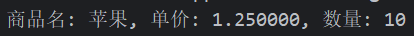

注意到了没有,在上面的案例中,浮点型数据输出居然有4个小数点,这是为什么呢?<br>
Python的数值型占位符都是有默认精度的,我们可以使用辅助符号小数点`.`来进行精度控制
```python
# 辅助符号控制精度的基本格式
m.n
```
`m`表示控制的字符宽度,没有此项就不限制长度,必须为整数;如果是正数,数字将右侧对齐,左侧填补空格,负数则左对齐,右侧填补空格;如果设置的宽度小于数字本身的宽度则无法生效<br>
`n`表示控制的小数位数,没有此项默保留6位小数,必须为正整数;如果设置的小数位数大于数字的小数位数,那么将在小数末尾补0,如果小于,则进行四舍五入<br>
小数点和小数位数也参与宽度计算,对于数字`11.345`,长度为`6`,小数位数为`3`
```python
# 辅助符号进行精度控制的举例
a = 1.234

print("a =" + "%5d" % a)
print("a =" + "%-5d" % a)
print("a =" + "%5.2f" % a)
print("a =" + "%.2f" % a)
print("a =" + "%2.f" % a)
print("a =" + "%.8f" % a)
```
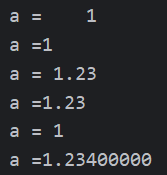

*这么看更像C语言了*

- 字符串快速格式化

使用占位符`%`实现格式化已经很方便了,还能进行精度控制,但是,追求效率和优雅的python觉得这个办法还是太麻烦了,所以,python提供了另一种更快速的格式化方法

通过语法: `f"内容{变量}"` 的格式来快速格式化
```python
# 使用快速格式化定义字符串
name = "苹果"
count = 3
price = 1.25
message = f"商品名:{name}, 单价:{price}, 数量:{count}"

print(message)
```
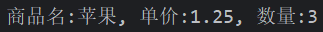

字符串快速格式化无视数据类型,不做精度控制

- 表达式格式化

在上面的演示举例中,都是基于变量的,那么,可不可以直接用表达式进行格式化呢?

当然是可以的,直接在变量的位置写上表达式,其效果也是相同的
```python
# 占位符格式化
print("1 * 1的结果是: %d" % (1 * 1))
print(f"1 * 1的结果是:{1 * 1}")
print("字符串在python中的类型是: %s" % (type("字符串")))
```
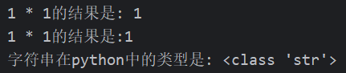

### 数据输入输出

- input函数

在python中, input函数的作用是获取键盘输入, 其使用方式很简单, 直接用一个变量储存所获取的键盘输入即可
```python
# input函数的基本用法
a = input() # 小括号必不可少

# 打印所获取的键盘输入
print("你输入的是:", a)
```
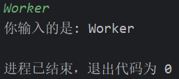

*为什么会有一个换行?*

在编程中, 我们通常需要在用户使用键盘输入之前给予相应的提示信息, 以方便用户理解他所需要输入的是什么数据, 
我们一般会使用专门的数据输出函数打印提示信息, 就像下面这样
```python
print("请输入你的名字:") # 使用print函数打印提示信息
name = input()

print(name)
```
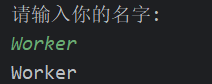

而在python中, input函数能直接使用字符串参数来打印提示信息
```python
name = input("请输入你的名字:")

print(name)
```
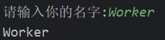

*两种方法在键盘输入时有什么区别?*

- 不同类型数据的输入

input函数的返回值类型为字符型`str`, 也就是说, 无论你输入的是数字、字母、汉字, 其存储到变量中的数据都是字符串
```python
# input函数的返回值类型
a = input()
b = input()
c = input()

# 打印变量的数据类型
print("变量 a:", a,"数据类型:", type(a))
print("变量 b:", b,"数据类型:", type(b))
print("变量 c:", c,"数据类型:", type(c))
```
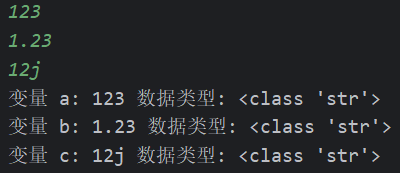

想要输入其他类型的数据, 我们就需要使用之前学过的数据类型转换函数
```python
# 使用input函数获取键盘输入
a = input()
b = input()
c = input()

# 使用类型转换函数转换数据类型
a = int(a) # 将 a 转换为整型
b = float(b) # 将 b 转换为实型
c = str(c) # 这么做没有意义

# 打印变量的数据类型
print("变量 a:", a, "数据类型:", type(a))
print("变量 b:", b, "数据类型:", type(b))
print("变量 c:", c, "数据类型:", type(c))
```
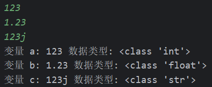

- print函数

与input函数的作用相反, print函数是将指定的数据输出到相应的位置, 其用法也很简单, 在括号内写上需要输出的数据即可
```python
# print函数的基本用法
print("内容")
```

注意! print函数输出后会, 默认会在输出的末尾加上一个换行符`\n`, 如果想要取消自动换行, 则需要用到特定的参数

- print函数的参数

print函数拥有几个用于格式控制的参数

`sep`参数用于指定多个值之间的间隔符, 默认为空格
```python
a = "Hello"
b = "World"
print(a, b, sep = '*')
```
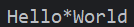

`end`参数用于指定字符串的结束符, 将其设置为空即可取消自动换行
```python
a = "Hello"
b = "World"
print(a, b, end = '!')
```
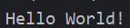
```python
# 取消print函数的自动换行
a = "Hello"
b = "World"

print(a, end = "")
print(b)
```
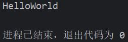

*因为第二个print没有使用end参数, 所以其尾部自动换行*

### 关系运算符与布尔类型

**关系运算符**

python提供了许多用于判断的关系运算符
```python
# 常见的关系运算符
a > b # 大于
a >= b # 大于等于
a < b # 小于
a <= b # 小于等于
a == b # 等于(判断是否相同)
a != b # 不等于(判断是否不相同)
```

关系表达式的结果为布尔值

**布尔类型(bool)**

布尔类型在python中属于数字(Number)类型, 只有两个字面量`True`和`False`

注意, 布尔类型的两个字面量`True`和`False`首字母必须大写
```python
a = true # 错误的语句
b = False # 正确的语句
```

实际上, python中的所有非空数据都被视为`True`, 例如非0数字、非空字符串、非空元组、非空集合等等;
相反的, 所有类型的空值都视为`False`, 例如空字符串、0、None、空元组等等

### 程序流程控制

**if语句**

python中提供了if语句进行判断

if语句的基本格式
```python
if <表达式> : # 冒号必不可少
    [语句]
```

python与其他大部分编程语言不同, 使用缩进进行语句块判断
```python
if <关系表达式> :
    [语句1] # 这条语句被if控制
    [语句2] # 这条语句被if控制
[语句3] # 这条语句不被if控制
```

*帮助你养成良好的缩进习惯*

**if...else语句**

python中同样可以使用`if...else`语句创建多分支判断
```python
moneyiHave = 100
moneyHeHave = 10000

if moneyiHave > moneyHeHave:
    print("小美喜欢我")
else :
    print("小美喜欢他")
```

*不需要打印输出, 你也应该知道答案*

注意, 因为python使用缩进进行语句块判断, 所以在不同缩进的`if`之后不能使用`else`
```python
# 错误示例
if 10 > 1:
    print("message")
    else : # 错误的缩进
    print("message")
```
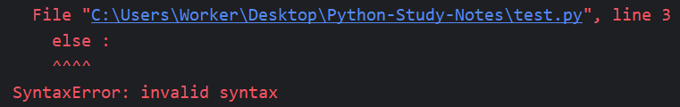

**if...elif...else语句**

python还提供了与c语言中switch语句功能类似但不完全相同的`if...elif...else`语句
```python
myLove = input("我喜欢的人是:")

if myLove == "小美":
    print(f"明天去跟{myLove}表白")
elif myLove == "小红":
    print(f"明天去跟{myLove}表白")
elif myLove == "小兰":
    print(f"明天去跟{myLove}表白")
else : # else语句可以不写, 但必须写在语句块末尾
    print(f"我不能跟{myLove}表白, 因为她不存在")
```
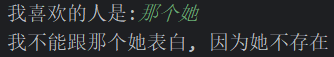

在`if...elif...else语句`中, 任意一个条件满足后, 程序流程将直接跳出该if语句块, 并执行后面的语句
```python
num = 10

if num < 10: # 条件不满足, 程序流程继续向下
    print("10")
elif num < 5: # 条件满足, 执行下面的语句, 并跳出该if语句块
    print("5")
else # 程序流程已经跳出, 此语句后面的语句将不会执行
    print("1")
print("end") # 程序流程跳出到该语句处, 并从此处开始继续向下逐句执行
```

如果你想用多个条件同时判断, 可以嵌套if语句, 或使用逻辑运算符
```python
# 简单的if语句嵌套, 判断游乐园儿童票
age = input("请输入年龄:")
height = input("请输入身高:")

age = int(age)
height = int(height)

if age <= 12:
    if height <= 140:
        print("儿童票")
    else :
        print("成人票")
```
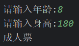

*上面的程序能改写为if...elif...else语句吗?*

**while语句**

python提供了与c语言一样的`while`语句用于循环
```python
# while语句的基本格式
while <表达式>:
    [语句1]
    [语句2]
```

只要`while`后面的表达式结果为真`True`, 那么循环将一直进行, 永远不会执行后面的语句
```python
# 这是一个死循环
while "向小美表白"
    print("小美我喜欢你!")
print("小美答应我的表白") # 程序流程永远不会转到这条语句
```

*永远无法到达的那个地方?*

```python
# 标准while语句的示例
i = 0 # 定义一个循环控制变量
while i > 10: # 正确的循环条件
    print("Hello, World!")
    i += 1 # 循环控制变量的更新, 保证不会构成死循环
print("End!")
```

`while`语句也可以嵌套使用
```python
# 打印九九乘法表
i = 1 # 外层循环的控制变量

while i <= 9:
    j = 1 # 内层循环的控制变量
    while j <= i:
        print(f"{j}x{i}={i * j}\t", end = '') # 打印乘法表
        j += 1 # 循环控制变量更新
    print() # 换行
    i += 1 # 循环控制变量更新
```

**for语句**

python的`for`循环语句与c语言不同, `for`循环是一种迭代结构, 即遍历每个元素, 并且自行控制循环, 不用手动写循环条件
```python
# for语句的基本格式
for <临时变量名列表> in <可迭代对象>
    [循环体]
```

`可迭代对象`包括:列表、元组、字符串、字典、集合、范围(range)

- 对于`列表`和`元组`, `for`遍历的是每个元素
- 对于`字符串`, `for`遍历的是每个字符
- 对于`字典`, `for`默认遍历的是每个键, 可以使用`values`方法遍历每个值, 还可以使用`items`方法遍历每个键值对
- 对于`集合`, `for`遍历的是每个元素
- 对于`范围(range)`, `for`遍历指定的范围

`for`语句跟`if`语句一样可以使用`else`子句, 但作用并不相同, `for`语句中的`else`子句的作用是在循环正常结束时(没有遇到`break`命令), 执行`else`子句控制的语句 
```python
date = ["7.24", "7.25", "7.26", "7.27", "7.28", "7.29"]  # 这是一个列表(list)

for value in date:
    print(f"今天是{value}, 我向小美表白了!")
else :
    print("小美还是没有接受我的表白!")
```
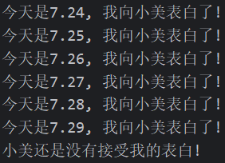
```python
times = "123456789"
for value in times:
    print(f"我向小美表白了{value}次")
    break
else :
    print("小美答应了我的表白")
print("小美还是没有答应我的表白")
```
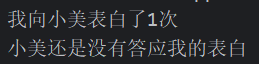

**范围(range)语句**

`for`循环不能自定义循环条件, 那么该如何控制循环次数呢? python提供了`range`语句进行`for`循环的条件控制
```python
# range语句的基本格式
range(<start>, <end>, <step>)
```

- `<start>`项表示范围的开始值, 必须是一个整数, 如果不写此项默认从`0`开始
- `<end>`项表示范围的结束值, 必须是一个整数,不包含值本身
- `<step>`项表示范围循环的步长, 必须是一个非`0`整数, 如果不写此项默认为`1`

```python
# range语句可以使用负数
for value in range(10, -2, -3):
    print(f"{value}, Hello, World!")
```
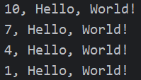

**循环控制命令**

python提供了跟c语言一样的两个循环控制命令, `break`和`continue`

- `break`命令的作用是直接跳出该循环, 然后执行该语句块后面的语句
- `continue`命令的作用是直接结束本次循环, 然后开始执行下一次循环
- `break`和`continue`命令可以在嵌套循环中使用, 但只控制命令本身所在的循环
- 不能在`else`子句中使用循环控制命令