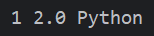

# Python 学习笔记
本笔记使用的Python版本为3.11

`更新时间:2024-09-12`

- `<>`必填项，必须在当前位置填写相应数据
- `{}`必选项，必须在当前位置选择一个给出的选项
- `[]`可选项，可以选择填写或忽略

*print("Hello World!")*

## Python 基础语法

**数据类型**

Python 中有6个数据类型，分别是:
- 数字(Number)
> 数字类型又可分为4种类型，即 整数(int), 浮点数(float), 
复数(complex), 布尔值(bool) <br>
> 
> - 整数(int), 例如 `10`, `-10`, `123`<br>
> - 浮点数(float), 例如 `13.4`, `-13.4`<br>
> - 复数(complex), 例如 `4+3j`, 以`j`结尾表示复数<br>
> - 布尔值(bool), 真(true), 假(false), 本质上是一个数字,
> `1`表示`true`, `0`表示`false`
- 字符串(String)
> 由任意数的字符组成, 必须用双引号`"`围起来, 例如 `"abc123"`, `"Python学习笔记"`
- 列表(List)
> 有序的可变序列, Python中使用最频繁数据类型
- 元组(Tuple)
> 有序的不可变序列, 可有序记录一堆不可变地Python数据集合
- 集合(Set)
> 无序不重复集合, 可无序记录一堆不重复地Python数据集合
- 字典(Dictionary)
> 无序Key-Value集合, 可无序记录一堆Key-Value型的Python数据集合

**注释**

*在所有编程语言中, 注释都是非常重要的工具*

在Python中, 注释与大多数编程语言一样, 分为两类<br>
- 行注释: 以井号`#`开头, 井号的右边所有文字作为注释
    ```python
    # 这是一条注释
    # 这是一条注释
    # 这是一条注释
    ```
- 段落注释: 用 一对三个双引号`"""` 括起来的内容作为段落注释
    ```python
    """
        这是一条注释
        这是一条注释
        这是一条注释 
    """
    ```
**变量**

Python是动态类型语言, 所以定义变量时无需声明变量类型

定义变量的格式: `<变量名>` = `<变量值>`
```python
# 定义一些变量
a = 1
b = 2.0
c = "Python"
# 输出这些变量
print(a, b, c)
```


Python从3.6开始也支持静态类型

静态类型变量的定义格式: `<变量名>` : `<变量类型>` = `<变量值>`
```python
# 定义一些静态变量
a : int = 1
b : float = 2.0
c : str = "Python"
# 输出这些变量
print(a, b, c)
```


Python本质上还是动态类型语言, 所以运行时还是以动态类型方式, 即使变量值与声明的类型不一致仍然能够运行
```python
# 定义一些与声明类型不一致的静态变量
a : str = 1
b : int = 2.0
c : bool = "Python"
# 输出这些变量
print(a, b, c)
```


**数据类型与转换**

上面我们已经学习了Python中常见的数据类型, 这里我们主要了解获取数据类型的方式与数据类型转换

Python提供一个专门的函数 `type()`用于获取变量或字面量的数据类型
```python
# 定义几个变量
a = 1       # 变量 a 是 int 类型
2.0     # 字面量 2.0 是 float 类型
c = "Python" # 变量 C 是 string 类型
# 获取并输出这几个变量的数据类型
print(type(a))
print(type(2.0))
print(type(c))
```


需要注意的是, 字符串类型(string) 的类型标识符为`str`, 而不是`string`

使用`type()`函数获取静态类型变量的数据类型时, 结果是怎样的?
```python
# 定义静态类型变量
a : int = 1
# 输出变量的数据类型
print(type(a))
# 给静态类型变量赋予一个不同类型的数据
a = 2.0
# 输出变量的数据类型
print(type(a))
```


也就是说, 即使使用静态类型变量, 其数据类型仍然跟随所储存的字面量的数据类型

`type()`函数拥有一个`str`类型的返回值, 返回值为所求取字面量或变量的数据类型

Python提供了许多用于数据类型转换的函数, 例如`int()`, `float()`, `str()`, 返回值为函数名
```python
# 类型转换函数的基本用法
<函数名>(<变量名或表达式>)
```
```python
# 定义不用的变量储存不同类型的数据
a = 1       # a 为 int 类型
b = 2.0     # b 为 float 类型
c = "333"   # c 为 str 类型
# 将它们的类型转换
a = str(a)
b = int(b)
c = float(c)
# 输出它们的数值和类型
print(a, type(a))
print(b, type(b))
print(c, type(c))
```


注意
- `int()`, `float()`等返回值为数值型的类型转换函数, 其参数只能是数值型或数字字符串
- `int()` 函数的参数为实型数据时, 返回值将直接舍弃小数部分, 只保留整数部分, 不进行四舍五入
- 任意字符都可以作为`str()`函数的参数

**标识符**

标识符就是编程时使用的名字,用于给变量、常量、函数等命名.
在Python中,标识符命名的规则有以下几点:
- 只允许使用英文、中文、数字、下划线
- 不能与系统标识符(关键字)关键字同名
- 对大小写敏感
- 不能以数字开头

以下是一些标识符的例子
```python
# 以下是一些合法的标识符
a_b
A_b     # 与a_b是两个不同的标识符
_ab
_a0123b
张三_a  # 合法,但不推荐

# 以下是一些不合法的标识符
import  # 与import命令重名
0_a11   # 以数字开头
```
尽管Python支持中文标识符,但中文标识符在使用过程中可能会出现未知的问题,所以不建议使用

*标识符名很简单*<br>
*字母数字下划线*<br>
*非数打头非关键*<br>
*字母区分大小写*<br>

**变量的命名规范**

标识符不仅有严格的命名规则,使用过程中还需要遵守其命名规范

Python中标识符的命名规范分为三种:
- 变量名
- 类名
- 方法名

不同的标识符有不同的命名规范,目前我们只学习了变量,所以只学习变量的命名规范

变量的命名规范有以下几点:

- 见名之意

要尽量做到,看到变量名字,就知道变量的作用
```python
# 以下的变量没有做到见名之意,无法一眼就了解其作用
a = "张三"
b = 21
c = 175

# 以下的变量能够做到见名之意,一目了然,简洁高效
name = "张三"
age = 21
height = 175
```

- 下划线命名法

多个单词组合命名时,要使用下划线分隔
```python
# 以下的变量没有使用下划线命名法,难以阅读
playernickname = "张三"
playerage = 21

# 以下的变量使用了下划线命名法,便于阅读
player_nickname = "张三"
player_age = 21
```

- 英文字母全小写

变量名中的英文字母应全部小写
```python
# 以下的变量的标识符大小写混用,使用时极易导致混乱
Name = "张三"
name = "小二"

# 以下的变量的标识符保持全部小写,无需担心使用时混淆大小写
name_1 = "张三"
name_2 = "小二"
```

*在大部分编程语言中,标识符的命名规则与规范都相差不大*

**运算符**

- 数学(算术)运算符

Python中的部分数学运算符与其他编程语言没有区别,加减乘除均为`+`,`-`,`*`,`/`,其余的有:<br>
取整除(不四舍五入)`//`, 取余`%`, 指数`**`
```python
a = 9
b = 2

# 取整除运算符 //, 向下取整, 不四舍五入
print("a // b =", a // b)

# 取余运算符 %, 又称取模运算符, 直接求取余数
print("a % b =", a % b)

# 指数运算符 **, 符号前为底数, 后为指数
print("a ** b =", a ** b)
```


- 赋值运算符

一个等号`=`就是一个赋值运算符,它的作用是将等号右边的表达式的值赋值给等号左边的变量

Python还提供了特别的复合赋值运算符, 它们的形式均为数学运算符后紧跟一个等号
```python
# 复合赋值运算符的形式
a += b  # 等同于 a = a + b
a -= b  # 等同于 a = a - b
a *= b  # 等同于 a = a * b
a /= b  # 等同于 a = a / b
a %= b  # 等同于 a = a % b
a **= b # 等同于 a = a ** b
a //= b # 等同于 a = a // b
```
*注意,复合赋值运算会直接改变变量的值,而数学运算不会改变变量的值*

**字符串**

- 字符串的定义方式

在上面我们已经学习了字符串的定义方法,为什么这里还要学习呢?<br>
在Python中,字符串其实有三种定义方法:
```python
# 单引号定义法 '
name = '张三'

# 双引号定义法 "
name = "张三"

# 三引号定义法 """
name = """张三"""
```

三引号定义法与段落注释写法一样,支持多行操作,使用变量接收,它就是字符串,不使用变量接收,它就是注释
```python
# 这是一个多行的字符串
message = """
    第一行文字
    第二行文字
    第三行文字
"""

# 这是一个段落注释
"""
    第一行文字
    第二行文字
    第三行文字
"""
```

- 转义符

我们刚刚学习了三种字符串的定义方式,它们都有一个共同点,都需要使用引号作为定界符,如果需要在字符串中使用定界符,那该怎么办呢?

我们可以使用与定界符不一样的引号,比如,使用单引号定义时,字符串中可以使用双引号,反之同理
```python
# 在字符串中使用引号
str_1 = "I'm Worker"
str_2 = 'I like "Minecraft"'

print(str_1 + '\n' + str_2)
```


另外,我们还可以使用一种名为转义符的特殊符号表示引号,它的用法很简单,并且不受定义方式的限制

转义符就是一个反斜线`\`, 其后紧跟需要转义的符号,比如单双引号`\'`,`\"`
```python
# 使用转义符号表示引号
str_1 = "I\'m Worker, I like \"Minecraft\""

print(str_1)
```


- 字符串拼接

如果我们有两个字符串,想要把它们链接成一个字符串,该怎么操作呢?这个时候,我们就需要用到python中的字符串拼接

在上面的案例中我们其实已经见过了,使用一个加号`+`即可拼接字符串
```python
# 拼接两个字符串
str_1 = "Hello"
str_2 = "World!"

print(str_1 + ", " + str_2)
```


*不是字符串的数据可以拼接吗?*

- 字符串格式化

如果只使用字符串拼接,那将会遇到很多问题,比如,无法将数字与字符串直接进行拼接,或是需要拼接的字符串太多,使用起来很麻烦,所以,python提供了字符串格式化来解决这些问题

字符串格式化需要使用一个占位符`%`,其后紧跟一个英文字母,不同的英文字母代表不同的数据类型<br>
在定义字符串时,将占位符写在字符串内需要替换的位置,并在字符串后加上一个百分号`%`,百分号右侧写上需要替换的内容变量列表,多个变量需要使用括号括起来,用逗号分隔
```python
# 一些基本的占位符
%s # 将内容转换为字符串, 放入占位位置
%d # 将内容转换为整数, 放入占位位置
%f # 将内容转换为浮点型, 放入占位位置
```
*似乎跟C语言有点类似呢*
```python
# 占位符的使用案例
name = "苹果" # 定义一个字符串数据
count = 10  # 定义一个整型数据
price = 1.25  # 定义一个浮点型数据
# 使用字符串格式化定义字符串
message = "商品名: %s, 单价: %f, 数量: %d" % (name, price, count)

print(message)
```


注意到了没有,在上面的案例中,浮点型数据输出居然有4个小数点,这是为什么呢?<br>
Python的数值型占位符都是有默认精度的,我们可以使用辅助符号小数点`.`来进行精度控制
```python
# 辅助符号控制精度的基本格式
m.n
```
`m`表示控制的字符宽度,没有此项就不限制长度,必须为整数;如果是正数,数字将右侧对齐,左侧填补空格,负数则左对齐,右侧填补空格;如果设置的宽度小于数字本身的宽度则无法生效<br>
`n`表示控制的小数位数,没有此项默保留6位小数,必须为正整数;如果设置的小数位数大于数字的小数位数,那么将在小数末尾补0,如果小于,则进行四舍五入<br>
小数点和小数位数也参与宽度计算,对于数字`11.345`,长度为`6`,小数位数为`3`
```python
# 辅助符号进行精度控制的举例
a = 1.234

print("a =" + "%5d" % a)
print("a =" + "%-5d" % a)
print("a =" + "%5.2f" % a)
print("a =" + "%.2f" % a)
print("a =" + "%2.f" % a)
print("a =" + "%.8f" % a)
```


*这么看更像C语言了*

- 字符串快速格式化

使用占位符`%`实现格式化已经很方便了,还能进行精度控制,但是,追求效率和优雅的python觉得这个办法还是太麻烦了,所以,python提供了另一种更快速的格式化方法

通过语法: `f"内容{变量}"` 的格式来快速格式化
```python
# 使用快速格式化定义字符串
name = "苹果"
count = 3
price = 1.25
message = f"商品名:{name}, 单价:{price}, 数量:{count}"

print(message)
```


字符串快速格式化无视数据类型,不做精度控制

- 表达式格式化

在上面的演示举例中,都是基于变量的,那么,可不可以直接用表达式进行格式化呢?

当然是可以的,直接在变量的位置写上表达式,其效果也是相同的
```python
# 占位符格式化
print("1 * 1的结果是: %d" % (1 * 1))
print(f"1 * 1的结果是:{1 * 1}")
print("字符串在python中的类型是: %s" % (type("字符串")))
```


